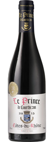

# France
## Rhone

Rhone[隆河区]位于法国南边，气候温热，以生产带有辛香料气味的红葡萄酒著名，葡萄品种以Syrah,Grenache为主。

有名的红酒Châteauneuf-du-Pape也是第一个使用AC分级制度，由多达13种葡萄混酿。此区一直到1980年代早期的时候才逐渐受到瞩目，飙高的人气也带动价格水涨船高。当然比起Burgundy和Bordeaus，此区的价格还是平易近人的。一般说来，Rhone酒不宜久藏，最好数年之内就解决掉。当然少数顶级酒仍有陈放一二十年的实力。

- 产区分级

     Rhone内的法定产区主要分为三级：

     1. AOC Cote du Rhone: 只有位于Rhone两岸的葡萄园才能标注上AOC Cote du Rhone，而离河远的只能说属于Rhone Valley。Cote du Rhone占了Rhone一大半产量。
     1. AOC Cote du Rhone Villages: 使用Grenache最少为50%，Syrah或Mouvedre最少20%，其它品种不能超过20%；粉红酒除品种比例河红酒由相同的限制外，混入的白酒品种不得超过20%，而且所有葡萄酒最低自然酒精度不得低于12度。
     1. AOC Crus des Cote du Rhone: 来自Rhone的15个自然条件最好的独立村镇，这些酒都善于陈放，并带有鲜明的个性河特色，是最值得尝试的酒。其中北Rhone有8个，南Rhone有7个。
     
### Le Prince de Courthezon Cotes du Rhone 2013

> Type: Red  
  Style/Body: Red - Medium Bodied  
  Country: France  
  Region: Rhône  
  Alcohol: 14.0 %  
  Grape: Grenache  
  Year: 2013  
  Appellation: Cotes du Rhone AOC  

- Made by Thierry Ferlay in a village cellar specializing in Châteauneuf-du-Pape as well as Côtes-du-Rhône.

> Châteauneuf-du-Pape is a French wine Appellation d'origine contrôlée (AOC) located around the village of Châteauneuf-du-Pape in the Rhône wine region in southeastern France. It is one of the most renowned appellations of the southern part of the Rhône Valley. [沙托纳迪帕普（法语：Châteauneuf-du-Pape）是法国普罗旺斯-阿尔卑斯-蓝色海岸大区 沃克吕兹省的一个市镇，属于阿维尼翁区 奥朗热西县。该市镇2009年时的人口 为2130人。 法语"Châteauneuf-du-Pape"意思实为“教皇新堡”，故而亦有此译名。]
     
- The same mix of grapes – juicy, ripe **Grenache** backed up by spicy **Syrah** and full-bodied **Mourvédre**. 
- Aromas: **ripe red fruit** underpinned by **black pepper** and **spicy oak**. The palate is brimming with **blackberry** and **raspberry** with hints of herbs. It’s balanced, velvety[可口的，天鹅绒般柔软的] smooth with a long, ripe finish.
- Serve with spicy pork sausages (check out the classic French dish cassoulet[肉焖豆]) or French onion soup with a hunk[大片，大块] of crusty bread.

